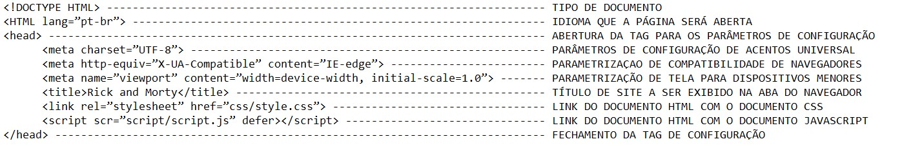
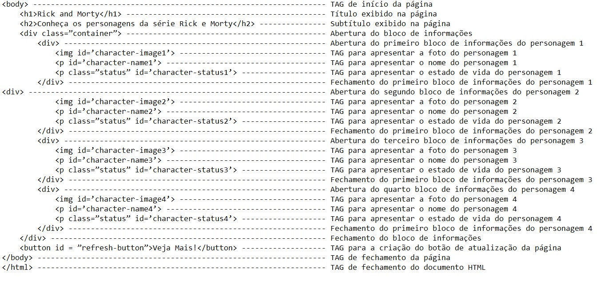
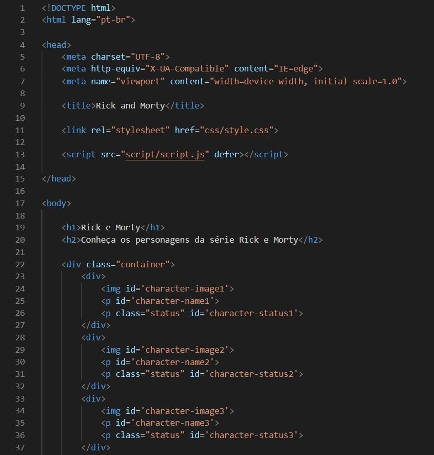
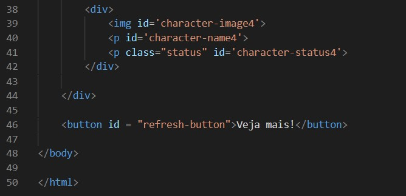
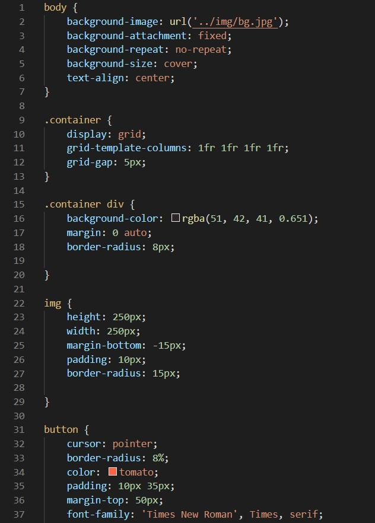
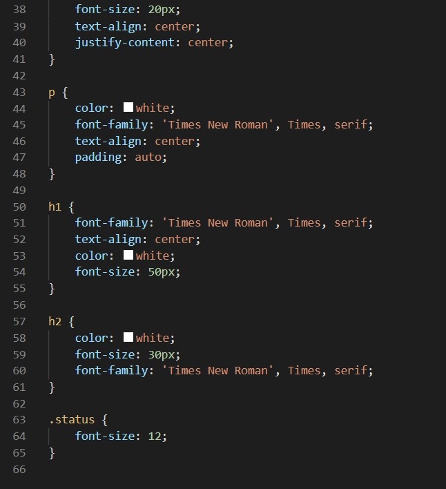
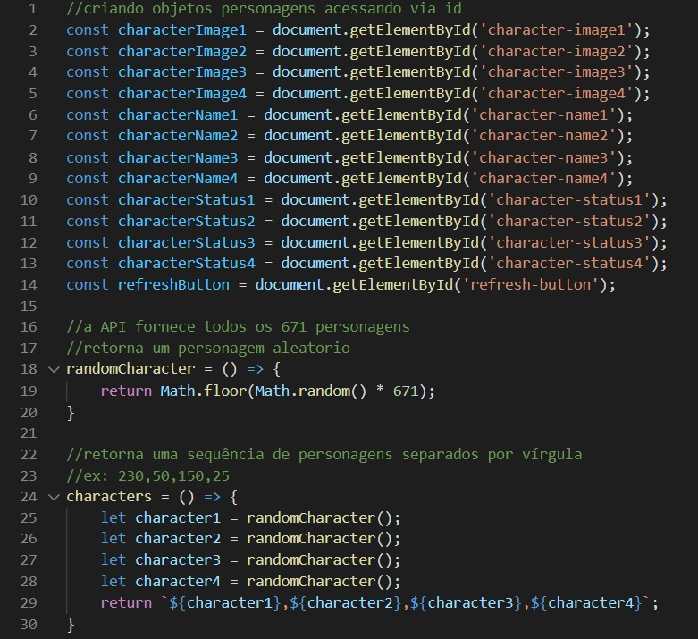
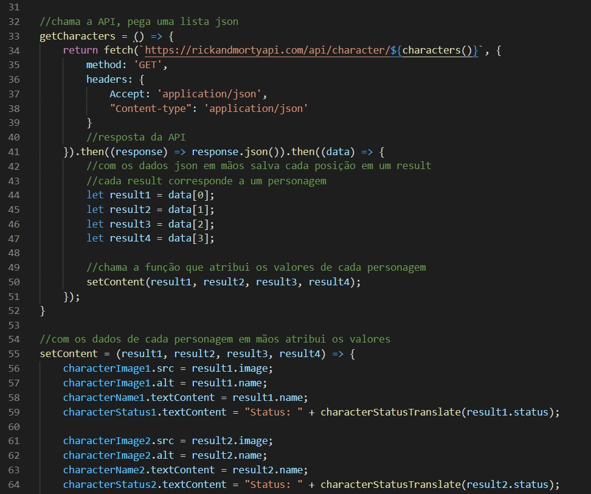
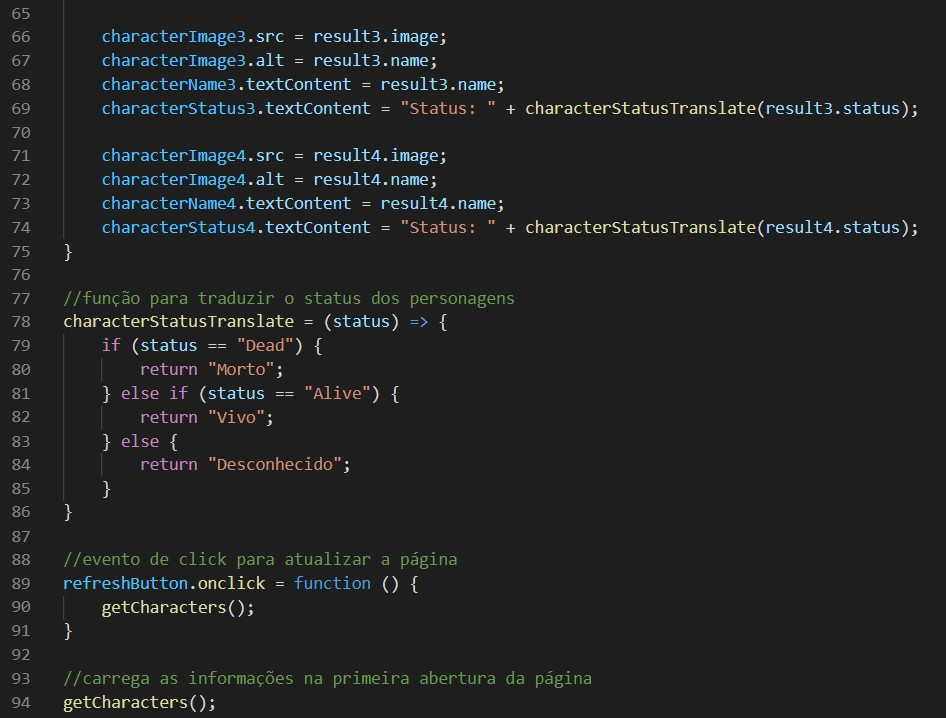

# Projeto Estrelas Fora da Caixa

## Relatório de construção de Código

​	Este é um relatório de construção de código usado como critério de avaliação para participação do projeto Estrelas Fora da Caixa, o conteúdo se dará pela explicação das tecnologias utilizadas para a construção deste projeto, sendo elas, HTML, CSS e JAVASCRIPT.

​        Foi proposto para os participantes do programa Estrelas fora da Caixa, a implementação de uma página que mostra aleatoriamente quatro personagens da série Rick e Morty e seus nomes, e sempre que a página for atualizada, outros quatro personagens deverão ser apresentados. Como acréscimo ao desafio, adicionei o estado de vida dos personagens e um botão para atualização da página.

​        Ao iniciar-se a criação do conteúdo é necessário a criação de uma nova pasta, onde será armazenada todos os arquivos produzidos. Todo o conteúdo produzido para este desafio, foi construído utilizando o editor de código da Microsoft, Visual Studio Code.

### HTML

​	O HTML não é uma linguagem de programação, ele é utilizado para construção do “esqueleto” do site.         

​	Inicia-se o arquivo em HTML com a parametrização de algumas informações, como tipo de documento e idioma da página, logo após foi inserido o elemento <head> seguidos dos elementos <meta> utilizados para configuração universal dos acentos, compatibilidade de navegadores e adaptação de tela em outros dispositivos, em seguida o elemento <title> para definir o título do site na aba do navegador, o elemento <link> utilizado para fazer a conexão entre o documento HTML e o CSS, e em seguida, o elemento <script> empregado para conectar o documento HTML ao documento em JavaScript. Todos esses elementos foram dispostos da seguinte forma:

​	

​	Após a estruturação dos parâmetros do documento, da-se início ao corpo do documento HTML pelo elemento <body>, contento dentro deste elemento, a TAG <h1> utilizado para o título da página no navegador, e <h2> como subtítulo. Em seguida o elemento 
 foi utilizado para a construção de blocos, para que fosse possível arquitetar o código em JAVASCRIPT e CSS, neste elemento foi utilizado o sistema de classes (*class*) para que o CSS acessasse esse documento.

​	No desafio foi proposto que a página mostrasse a imagem de quatro personagens, para isso foram criados quatro blocos, usando a TAG 
 e dentro de cada bloco, contém o elemento , para a busca da foto do personagem e a “id” que será utilizada no JAVASCRIPT. O elemento 
 para o nome do personagem, também com um “id” e outro elemento 
 para o estado de vida do personagem com um “id” e também foi atribuído uma *class*, para que fosse possível a aplicação do CSS nessa frase.  A TAG 
 é utilizada para escrever uma frase. 

​	E por último, foi implementado o elemento <button> para a criação de um botão de atualização da página, com o intuito de gerar mais interatividade entre a página e o usuário. Também foi atribuída a esta TAG um “id”.

- Todo o documento HTML, ficou da seguinte forma:

### CSS

​	O CSS é uma de marcação de estilo e é usado para formatar o layout da página HTML. 

​	Dentro dele é utilizado os seletores que é a indicar qual elemento do HTML será formatado, após a chamada do elemento pelo Seletor, utiliza-se as propriedades de formatação dentro de chaves “{}”, estas por sua vez, indicam a abertura e fechamento de cada elemento estilizado. Nas propriedades são atribuídos valores, o que define a intensidade ou modo de alteração. Ao final de cada propriedade foi utilizado o sinal de ponto-e-vígula “;” para o encerramento de cada uma delas.

​	Em alguns elementos do HTML foi utilizado o sistema de classes, chamado *class,* para acessar um determinado elemento do HTML.

- Todo conteúdo CSS ficou da seguinte maneira:

​	

​	

### JAVASCRIPT

​	O JavaScript é uma linguagem de programação utilizada para gerar um ambiente mais interativo com o usuário, é ele que controla os elementos interativos que respondem a ação dos perifericos,  menus, janelas, botões e players de áudio e vídeo.

​	Este projeto foi construído da seguinte forma:

 

- Foi criado quatro constantes, uma para cada personagem;

- A função *randomCharacter()* foi criado para retornar o número de um personagem aleatoriamente, este número varia de 1 à 671;
- A função *characters()* retorna o número de quatro personagens aleatoriamente, e diferente do método acima, este entrega os números dos personagens separados por vírgula, para ser usado na requisição da API;
- A função *getCharacters()* é a responsável por trazer os dados dos personagens no formato *json;*
- Após a resposta do API, e os dados em “mãos” o resultado é armazenado em quatro variáveis;
- A função *setContent(...)* que atribui os valores a cada um dos quatros personagem;
- Seguindo a atribuição dos valores, de acordo com o número de cada personagem, é adicionado a foto, nome e status para cada um dos quatro personagens;
- characterStatusTranslate = (status),* foi a função utilizada para traduzir o estado de vida dos personagens;
- A função *onclick()*, atribuiu o evento de clique na página, para atualização do site;
- A função *getCharacters()*, foi utilizada para carregar as informações já na primeira abertura da página; 

- Todo o documento JS ficou da seguinte forma:

</img>

</img>

</img>

